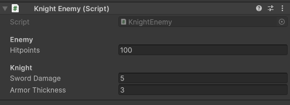
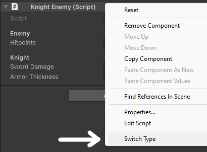
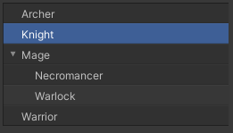
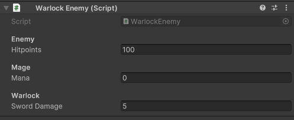
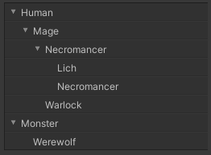

# Type Switcher
 
Easily select the type of a MonoBehaviour or ScriptableObject from a list of all derived classes.

## How it works (example)

Let's say you have a `Knight Enemy` component, which derives from `Enemy`, 
which in turn derives from `SwitchableMonoBehaviour`, provided by this plugin.



By right-clicking on the component, in the context menu you'll see an option to *Switch Type*.



A dropdown menu with all existing `Enemy` subclasses will open.
Let's pick the Warlock.



You just switched the component's type from Knight to Warlock. 
Any serialized values will persist if they have the same name in both classes.



Any type you switch to will also allow switching the same way. 

## Setup

#### MonoBehaviour

In the class that you wish to use as a base, 
inherit from `SwitchableMonoBehaviour<T>` and provide self as the generic type.
This class doesn't need to be abstract.

```csharp
public abstract class Enemy : SwitchableMonoBehaviour<Enemy>
{
    // ...
}
```

#### ScriptableObject

Same thing, just inherit from `SwitchableScriptableObject<T>` this time.

```csharp
[CreateAssetMenu(fileName = "Potion", menuName = "TypeSwitcher/Potion")]
public class Potion : SwitchableScriptableObject<Potion>
{
    // ...
}
```

### Folders, inheritance, attributes

To improve clarity, type switcher completely ignores class inheritance when displaying types
in the dropdown.

Instead, folders can be created using the `TypeCategory` attribute. 
When applied to a class, it puts this class along with all its children in a folder 
with the specified name.
These attributes follow inheritance and can be stacked.

Abstract classes are not displayed in the dropdown, but attributes still work on them.

It's a good idea to use the `nameof` keyword 
if categories correspond to the names of your classes.

Keep in mind that all these classes would need to be in separate files for this to work properly.

```csharp
public class Character : SwitchableMonoBehaviour<Character> { }

[TypeCategory(nameof(Human))]
public abstract class Human : Character { }

[TypeCategory("Monster")]
public class Werewolf : Character { }

[TypeCategory(nameof(Mage))] 
public abstract class Mage : Human { }

[TypeCategory(nameof(Necromancer))] 
public class Necromancer : Mage { }

public class Lich : Necromancer { }

public class Warlock : Mage { }

```

The code above will produce this dropdown:



### Settings

Properties of `TypeSwitchSettings` can be adjusted to make the switcher suit your needs.

Among others, you can specify the base type dynamically (i.e. in non-static context) 
or use a custom getter for type names.